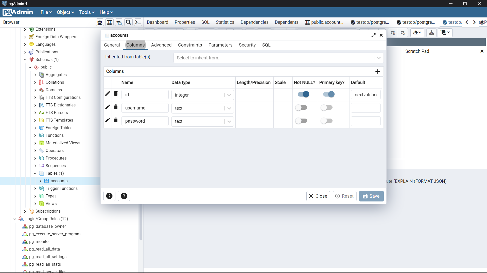

NODEJS FOR BEGINNERS

====================================================================
# I . Install Environments
* Nodejs docs : https://nodejs.org/dist/

====================================================================
# I . Install Environments

* Dowload and Install Visual Studio Code (https://code.visualstudio.com/download)
* Dowload and Install NodeJS (https://nodejs.org/en/download)
* Dowload and Install Git (https://git-scm.com/downloads)   // For source code management
* Check NodeJS : Open 'Command Prompt' enter 'node -v' 

====================================================================
# II. Hello World with ReactJS
> ref : https://nodejs.dev/learn/introduction-to-nodejs#a-vast-number-of-libraries

* Create new React App (https://reactjs.org/docs/create-a-new-react-app.html)
    * Open the folder where you want to create the project
    * Open 'Command Prompt' or 'Git Bash' in this folder
    * Type the following commands

            mkdir learning-nodejs-basic
            cd learning-nodejs-basic

    * note : In it you can replace [learning-nodejs-basic] with your project name ( npx create-react-app <project-name> )

    * Reopen your project ReactJS with Visual Studio Code
    * Create file [app.js] in folder [learning-nodejs-basic]

* Open app.js anh write the code following :

        const http = require('http');

        const hostname = '127.0.0.1';
        const port = 3000;

        const server = http.createServer((req, res) => {
            res.statusCode = 200;
            res.setHeader('Content-Type', 'text/plain');
            res.end('Hello World');
        });

        server.listen(port, hostname, () => {
            console.log(`Server running at http://${hostname}:${port}/`);
        });

* Open Termial (in Visual Studio Code) 
    * Type the following commands

            node app.js

    * Output :

        Server running at http://127.0.0.1:3000/

    * Now, run your web server using node app.js. Visit http://localhost:3000 and you will see a message saying "Hello World". 

* Explain code : 
            
    * Node.js has a built-in module called HTTP, which allows Node.js to transfer data over the Hyper Text Transfer Protocol (HTTP).
    > To include the HTTP module, use the require() method:

            const http = require('http');

    * The HTTP module can create an HTTP server that listens to server ports and gives a response back to the client.
    > Use the createServer() method to create an HTTP server:

            const hostname = '127.0.0.1';
            const port = 3000;

            const server = http.createServer((req, res) => {
                res.statusCode = 200;
                res.setHeader('Content-Type', 'text/plain');
                res.end('Hello World');
            });

            server.listen(port, hostname, () => {
                console.log(`Server running at http://${hostname}:${port}/`);
            });

    * In this case with:

            res.statusCode = 200

    > we set the statusCode property to 200, to indicate a successful response.

    * We set the Content-Type header:

            res.setHeader('Content-Type', 'text/plain')

    * And we close the response, adding the content as an argument to end():

            res.end('Hello World')

        > The res.end() function will end the process and send the response

====================================================================
# II. Node.js Local Module
* Local module are modules created locally in your Node.js application
* These modules include different functionalities of your applicaiton in separete files and folders

* Writing Simple Module
    * Create file [module.js] in folder [learning-nodejs-basic]
    * Write the following code into the file [module.js]

            function notificationRunningServer(hostname, port) {
                console.log(`Server running at http://${hostname}:${port}/`);
            }

            module.exports.notifiRunServer = notificationRunningServer

    * Change code in file [app.js] follows:

            const http = require('http');
            const myModule = require('./module');

            const hostname = '127.0.0.1';
            const port = 3000;

            const server = http.createServer((req, res) => {
                res.statusCode = 200;
                res.setHeader('Content-Type', 'text/plain');
                res.end('Hello World');
            });

            server.listen(port, hostname, () => {
                myModule.notifiRunServer(hostname,port);
                myModule.notifiRunServer('localhost',port);
            });

    * To use local modules in your application, you need to load it using require() function in the same way as core module.

            const myModule = require('./module');
            ..
            ..
            myModule.notifiRunServer(hostname,port);

====================================================================
# III. Output HTML Tag
* For ease we will refactor the project
    * Create folder [MModules] to contain local module
    * Move file [module.js] into folder [MModules]
    * Create file [MModules>config.js]
    * 

            "Your project"
            │
            │   app.js
            │
            └───MModules
                    config.js
                    module.js

* Write the following code into the file [MMdoules>config.js]

        module.exports = {
            hostname : '127.0.0.1',
            port : 3000,
        }

* Write the following code into the file [app.js]

        const http = require('http');
        const myModule = require('./MModules/module');
        const config = require('./MModules/config')

        const hostname = config.hostname;
        const port = config.port;

        const server = http.createServer((req, res) => {
            res.statusCode = 200;
            res.setHeader('Content-Type', 'text/html');
            res.end('<h1 style="color : red">Hello World</h1>\<h2 style="color : red">Hello MinhChu</h2>');
        });

        server.listen(port, hostname, () => {
            myModule.notifiRunServer(hostname, port);
            myModule.notifiRunServer('localhost', port);
        });

* Note: need set Content-type is 'text/html' to using html tag

        res.setHeader('Content-Type', 'text/html');

* Run code

    node app.js

* Content-Type :
1. Type application

        application/java-archive
        application/EDI-X12   
        application/EDIFACT   
        application/javascript   
        application/octet-stream   
        application/ogg   
        application/pdf  
        application/xhtml+xml   
        application/x-shockwave-flash    
        application/json  
        application/ld+json  
        application/xml   
        application/zip  
        application/x-www-form-urlencoded  
        
2. Type audio

        audio/mpeg   
        audio/x-ms-wma   
        audio/vnd.rn-realaudio   
        audio/x-wav

3. Type image

        image/gif   
        image/jpeg   
        image/png   
        image/tiff    
        image/vnd.microsoft.icon    
        image/x-icon   
        image/vnd.djvu   
        image/svg+xml    

4. Type multipart

        multipart/mixed    
        multipart/alternative   
        multipart/related (using by MHTML (HTML mail).)  
        multipart/form-data 

5. Type text

        text/css    
        text/csv    
        text/html    
        text/javascript (obsolete)    
        text/plain    
        text/xml

6. Type video

        video/mpeg    
        video/mp4    
        video/quicktime    
        video/x-ms-wmv    
        video/x-msvideo    
        video/x-flv   
        video/webm   

7. Type vnd :

        application/vnd.android.package-archive
        application/vnd.oasis.opendocument.text    
        application/vnd.oasis.opendocument.spreadsheet  
        application/vnd.oasis.opendocument.presentation   
        application/vnd.oasis.opendocument.graphics   
        application/vnd.ms-excel    
        application/vnd.openxmlformats-officedocument.spreadsheetml.sheet   
        application/vnd.ms-powerpoint    
        application/vnd.openxmlformats-officedocument.presentationml.presentation    
        application/msword   
        application/vnd.openxmlformats-officedocument.wordprocessingml.document   
        application/vnd.mozilla.xul+xml   

====================================================================
# IV. Automatically restarting the node application with nodemon (https://www.npmjs.com/package/nodemon)
* nodemon is a tool that helps develop node.js based applications by automatically restarting the node application when file changes in the directory are detected.
* Install nodemon 

        npm install -g nodemon

* Check install

        npm ls -g

* Try run code with nodemon

        nodemon app

    * note : nodemon [your node app]

* Fix error :
> nodemon : File ..... cannot be loaded because running scripts is disabled on this system. For more information, see about_Execution_Policies at https:/go.microsoft.com/fwlink/?LinkID=.....

1. Open PowerShell (Run As Administrator)
2. Check the current execution policy using this command

        Get-ExecutionPolicy
        # You should get 'Restricted'

3. Run this command to make it 'Unrestricted'

        Set-ExecutionPolicy Unrestricted

4. Check again whether execution policy changed by running this command

        Get-ExecutionPolicy
        # You should get 'Unrestricted'

5. Now try to run nodemon on your project

        nodemon [your node app]

* cre : https://stackoverflow.com/questions/63423584/how-to-fix-error-nodemon-ps1-cannot-be-loaded-because-running-scripts-is-disabl

====================================================================
# V. Output HTML File using File System with Nodejs 

* Create folders and files following : 

        "your project"
        │   
        └───page
            └───home
                    homepage.html

* Writing simple code
    * Write the following code into file [page>home>homepage.html] :

            <!DOCTYPE html>
            <html lang="en">

            <head>
                <meta charset="UTF-8">
                <meta http-equiv="X-UA-Compatible" content="IE=edge">
                <meta name="viewport" content="width=device-width, initial-scale=1.0">
                <title>Document</title>
            </head>

            <body>
                <h1 style="color : red">Hello World</h1>
                <h2 style="color : rgb(0, 110, 255)">Home Page</h2>
            </body>

            </html>

    * Write the following code into the file [app.js] 

            const http = require('http');
            const { readFile } = require('fs')

            const myModule = require('./MModules/module');
            const config = require('./MModules/config')

            const hostname = config.hostname;
            const port = config.port;

            const server = http.createServer((req, res) => {
                readFile('./page/home/homepage.html', (err, data) => {
                    if (err) throw err;
                    res.write(data);
                    res.end('End page');
                })
            
            });

            server.listen(port, hostname, () => {
                myModule.notifiRunServer(hostname, port);
                myModule.notifiRunServer('localhost', port);
            });

    
* Explain code : (ref : https://nodejs.org/api/fs.html#fsreadfilepath-options-callback)

        readFile('./page/home/homepage.html', (err, data) => {
            if (err) throw err;
            res.write(data);
            res.end('End page');
        })       

    * Function:

            fs.readFile(path[, options], callback)
            
    * The callback is passed two arguments (err, data), where data is the contents of the file.

====================================================================
# VI. Routing basic with NodeJS

* Write the following code into the file [app.js]

        const http = require('http');
        const { readFile } = require('fs')
        const url = require('url')

        const myModule = require('./MModules/module');
        const config = require('./MModules/config')

        const hostname = config.hostname;
        const port = config.port;

        function onRequest(req, res) {
            console.log(">> check req.url : ", req.url);
            console.log(">> check url.parse(req.url) : ", url.parse(req.url,true));
            readFile('./page/home/homepage.html', (err, data) => {
                    if (err) throw err;
                    res.write(data);
                    res.end('End page');
            })
        }
        const server = http.createServer(onRequest);

        server.listen(port, hostname, () => {
            myModule.notifiRunServer(hostname, port);
            myModule.notifiRunServer('localhost', port);
        });

* Run code and try

    http://127.0.0.1:3000/
    
    http://127.0.0.1:3000/abc

    http://127.0.0.1:3000/abc/xyz

    http://127.0.0.1:3000/abc/xyz?foo=bad&baz=foo 

* Parse an address with the url.parse() method, and it will return a URL object with each part of the address as properties
* Ref url.parse() : https://nodejs.org/api/url.html#urlparseurlstring-parsequerystring-slashesdenotehost
* Ref query parameters : https://nodejs.org/en/knowledge/HTTP/clients/how-to-access-query-string-parameters/

* Writing simple routing with NodeJS

    * Create files and folders as follows:

            │   app.js
            │   README.md
            │
            ├───MModules
            │       config.js
            │       hepler.js
            │       module.js
            │
            └───page
                ├───about
                │       index.html
                │
                ├───error
                │       index.html
                │
                └───home
                        index.html

    * Write the following code into the file [page>about>index.html]

                <!DOCTYPE html>
                <html lang="en">

                <head>
                    <meta charset="UTF-8">
                    <meta http-equiv="X-UA-Compatible" content="IE=edge">
                    <meta name="viewport" content="width=device-width, initial-scale=1.0">
                    <title>About</title>
                </head>

                <body>
                    <h1 style="color : red">Hello World</h1>
                    <h2 style="color : rgb(0, 255, 38)">About Page</h2>
                    
Lorem ipsum dolor sit amet consectetur adipisicing elit. Perferendis laborum fuga ipsam. Atque voluptatibus
                            officiis dignissimos, consequuntur ipsa ut vel vitae pariatur repellendus ea ducimus in similique dolor aliquam.
                            Accusantium.

                </body>

                </html>

    * Write the following code into the file [page>home>index.html]

            <!DOCTYPE html>
            <html lang="en">

            <head>
                <meta charset="UTF-8">
                <meta http-equiv="X-UA-Compatible" content="IE=edge">
                <meta name="viewport" content="width=device-width, initial-scale=1.0">
                <title>Home</title>
            </head>

            <body>
                <h1 style="color : red">Hello World</h1>
                <h2 style="color : rgb(0, 26, 255)">Home Page</h2>
            </body>

            </html>

    * Write the following code into the file [page>error>index.html]

            <!DOCTYPE html>
            <html lang="en">

            <head>
                <meta charset="UTF-8">
                <meta http-equiv="X-UA-Compatible" content="IE=edge">
                <meta name="viewport" content="width=device-width, initial-scale=1.0">
                <title>Error</title>
            </head>

            <body>
                <h1 style="color : red">Hello World</h1>
                <h2 style="color : rgb(255, 0, 0)">Error Page</h2>
            </body>

            </html>

    * Write the following code into the file [MModules>hepler.js]

            const fs = require('fs')
            const url = require('url')

            const renderPage = (pathname, res) => {
                fs.readFile(pathname, (err, data) => {
                        if (err) {
                        res.statusCode = 404;
                        res.setHeader('Content-Type', 'text/html');
                        res.write("<h1 style='color : red'>Not found</h1>");
                        } else {
                        res.write(data);
                        }

                        res.end('End page');
                })
            }

            const render404 = (pathname, res) => {
                res.statusCode = 404;
                renderPage(pathname, res);
            }

            function onRequest(req, res) {
                const pathname = url.parse(req.url, true).pathname
                console.log(">> check url.parse(req.url).pathname : ", pathname);
                switch (pathname) {
                        case '/':
                        case '/home':
                            renderPage('./page/home/index.html', res)
                            break;
                        case '/about':
                            renderPage('./page/about/index.html', res)
                            break;
                        default:
                            render404('./page/error/index.html', res)

                }

            }

            module.exports = {
                onRequest: onRequest
            }

    * Write the following code into the file [MModules>config.js]

            module.exports = {
                hostname : '127.0.0.1',
                port : 3000,
            }
    
    * Write the following code into the file [MModules>module.js]

            function notificationRunningServer(hostname, port) {
                console.log(`Server running at http://${hostname}:${port}/`);
            }

            module.exports.notifiRunServer = notificationRunningServer

    
    * Write the following code into the file [app.js]

            const http = require('http');

            const hepler = require('./MModules/hepler');
            const myModule = require('./MModules/module');
            const config = require('./MModules/config');

            const hostname = config.hostname;
            const port = config.port;

            const server = http.createServer(hepler.onRequest);

            server.listen(port, hostname, () => {
                myModule.notifiRunServer(hostname, port);
            });

* Run code and testing

====================================================================
# VI. ExpressJS https://expressjs.com/

* Note : You can create a new project or delete everything in the old project

* Install ExpressJS (https://expressjs.com/en/starter/installing.html)

        npm init

        npm install express
        

* Hello World Example (https://expressjs.com/en/starter/hello-world.html)
    * Create file [index.js] and write code into this file :

            const express = require('express')
            const app = express()
            const port = 3000

            app.get('/', (req, res) => {
                res.send('Hello World!')
            })

            app.listen(port, () => {
                console.log(`Example app listening on port http://localhost:${port}/`)
            })

* Run app
    * In the file [package.json], adding line "start": "nodemon index.js" into "scripts" 

            .
            ..
            .
            "scripts": {
                "test": "echo \"Error: no test specified\" && exit 1",
                "start": "nodemon index.js"
            },
            .
            .
            ..
            ...
            .
            .

    * Run app with command

            nodemon 

    Or 

            npm start

====================================================================
# VII. Router in ExpressJS (https://expressjs.com/en/guide/routing.html#express-router)

* Create new files [apiRouter.js]
* Example code :
    * Write the following code into the file [apiRouter.js]

            const express = require('express');
            const router = express.Router();

            router.use((req, res, next) => {
                res.writeHead(200, { 'Content-Type': 'text/html' })
                res.write('<a href="/api/v1/about">/api/v1/about</a>  ')
                res.write('<a href="/api/v1/cart">/api/v1/cart</a> ')
                res.write('<a href="/api/v1/cart/abcxyz">/api/v1/cart/abcxyz</a> ')
                res.write('<a href="/api/v1/cart/a1b2c3">/api/v1/cart/a1b2c3</a> ')
                res.write('<a href="/api/v1/">/api/v1/</a> ')
                res.write(` Time: ${Date.now()}  `);
                next();
            })

            router.get('/about', (req, res) => {
                res.write('This is "About" page ');
                res.send();
            })

            router.get('/cart', (req, res) => {
                res.write('Welcome ');
                res.write('This is "cart" page');
                res.send();
            })
            router.get('/cart/:id', (req, res) => {
                res.write(`This is "cart" page , with parameter id : ${req.params.id}`)
                res.send();
            })

            router.get('/', (req, res) => {
                res.write('This is "Home" page')
                res.send();
            })

            module.exports = {
                router
            } 

    * Write the following code into the file [index.js]

            const express = require('express');
            const app = express();
            const port = 3000;
            const { router } = require('./apiRouter');

            app.use("/api/v1", router);
            app.listen(port, () => {
                console.log(`Example app http://localhost:${port}/api/v1`)
            })
        
* Explain code:
    * In the file [apiRouter.js]
        *  Middleware that is specific to this router

                router.use((req, res, next) => {
                    res.writeHead(200, { 'Content-Type': 'text/html' })
                    ...
                    ..
                    res.write('<a href="/api/v1/">/api/v1/</a> ')
                    res.write(` Time: ${Date.now()}  `);
                    next();
                })

        > If the current middleware function does not end the request-response cycle, it must call **next()** to pass control to the next middleware function. Otherwise, the request will be left hanging.
        > Middleware : https://expressjs.com/en/guide/writing-middleware.html

    * In the file [index.js]

            const { router } = require('./apiRouter');
            .
            .
            .
            app.use("/api/v1", router);

        * The app will now be able to handle requests to /api/v1/ and /api/v1/about and /api/v1/cart and ....
        * As well as call the timeLog middleware function that is specific to the route.

====================================================================
# VII. Middleware (https://expressjs.com/en/guide/using-middleware.html)
* Middleware functions are functions that have access to the request object (req), the response object (res), and the next middleware function in the application's request-response cycle. The next middleware function is commonly denoted by a variable named next.

* Example code :
    * Write the following code into the file [index.js]

            const express = require('express');
            const app = express();
            const port = 3000;
            const { router } = require('./apiRouter');

            app.use("/", router);
            app.listen(port, () => {
            console.log(`Example app http://localhost:${port}/`)
            })

    * Write the following code into the file [apiRouter.js]

            const express = require('express');
            const router = express.Router();

            router.use((req, res, next) => {
                res.writeHead(200, { 'Content-Type': 'text/html' })
                res.write('<a href="/user/abcxyz">/user/abcxyz</a> ')
                res.write('<a href="/user/a1b2c3">/user/a1b2c3</a> ')
                res.write('<a href="/user/0">/user/abcxyz</a> ')
                res.write('<a href="/admin/abcxyz">/admin/abcxyz</a> ')
                res.write('<a href="/admin/a1b2c3">/admin/a1b2c3</a> ')
                res.write('<a href="/admin/0">/admin/0</a> ')
                res.write('<a href="/">/</a> ')
                res.write(` Time: ${Date.now()}  `);
                next();
            })

            const checkReq = (req, res, next) => {
                console.log(">> Check req : ", req)
                next();
            }
            const getMethod = (req, res, next) => {

                res.write(`Request Type: ${req.method}  `);
                next();
            }

            const getOriginalUrl = (req, res, next) => {
                res.write(`Request origin Url: ${req.originalUrl}  `);
                next();
            }

            const getParamsId = (req, res, next) => {
                res.write(`Request params id  : ${req.params.id}  `);
                next();
            }

            const checkID = (req, res, next) => {
                if (req.params.id === '0') next('route')
                // otherwise pass control to the next middleware function in this stack
                else next()
            }

            //---------------------------

            router.get('/user/:id', getMethod, checkID, getOriginalUrl, getParamsId)

            router.get('/user/:id', (req, res, next) => {
                res.write('This is "User" page(1) ');
                res.send();
            })

            //---------------------------

            const logStuff = [getMethod, getOriginalUrl, getParamsId]
            router.get('/admin/:id', checkID, (req, res, next) => {
                res.write('This is "Admin" page(1) ');
                res.send();
            }, logStuff)

            router.get('/admin/:id', (req, res, next) => {
                res.write('This is "Admin" page(2) ');
                res.send();
            }, logStuff)

            router.get('/', (req, res) => {
                res.write('This is "Home" page')
                res.send();
            })

            module.exports = {
                router
            } 

* Explain code:
    * The function middleware first has a chance to call **next()** to pass control to middleware second, or **next('route')** to pass control to the next matching route altogether.

====================================================================
# VIII. GET POST PUT DELETE 
* Install extensions JSON viewer for google chrome to easily view .json file
    * Link install : https://chrome.google.com/webstore/detail/json-viewer/gbmdgpbipfallnflgajpaliibnhdgobh
* Install body-parser

        npm install body-parser

    > Node.js body parsing middleware.
    > Parse incoming request bodies in a middleware before your handlers, available under the req.body property.
    > ref : http://expressjs.com/en/resources/middleware/body-parser.html

* Example code 
    * Write the following code into the file [index.js]

            const express = require('express');
            const app = express();
            var bodyParser = require('body-parser');

            const port = 3000;
            const { router } = require('./apiRouter');

            app.use(bodyParser.urlencoded({ extended: false }));
            app.use(bodyParser.json());

            app.get("/", (req, res) => {
                res.writeHead(200, { 'Content-Type': 'text/html' });
                res.write("<h1>TEST GET</h1>");
                res.write('<a href="/api?username=admin&pass=123456">/api?username=admin&pass=123456</a> ');

                res.write("<h1>TEST POST</h1>");
                res.write("<form action='/api' method='POST'>");
                res.write("<label>Username: </label><input type='text' name='username'> ");
                res.write("<label>Pass: </label><input type='text' name='pass'> ");
                res.write("<input type='submit' name='submit' value='submit POST'> ");
                res.write("</form>");

                res.write("<h1>TEST PUT</h1>");
                res.write("<form action='/api' method='PUT'>");
                res.write("<label>Username: </label><input type='text' name='username'> ");
                res.write("<label>Pass: </label><input type='text' name='pass'> ");
                res.write("<input type='submit' name='submit' value='submit PUT'> ");
                res.write("</form>");

                res.write("<h1>TEST DELETE</h1>");
                res.write("<form action='/api' method='DELETE'>");
                res.write("<label>Username: </label><input type='text' name='username'> ");
                res.write("<label>Pass: </label><input type='text' name='pass'> ");
                res.write("<input type='submit' name='submit' value='submit DELETE'> ");
                res.write("</form>");

                res.send();
            });

            app.use("/api", router);
            app.listen(port, () => {
                console.log(`Example app http://localhost:${port}/`);
            });

    * Write the following code into the file [apiRouter.js]

            const express = require('express');
            const router = express.Router();

            router.get('/', (req, res) => {
                res.json({ Method: "Router using GET", Headers: req.headers, Body: req.body })
            })

            router.post('/', (req, res) => {
                res.json({ Method: "Router using POST", headers: req.headers, body: req.body })
            })

            router.put('/', (req, res) => {
                res.json({ Method: "Router using PUT", headers: req.headers, body: req.body })
            })

            router.delete('/', (req, res) => {
                res.json({ Method: "Router using DELETE", headers: req.headers, body: req.body })
            })

            module.exports = {
                router
            } 

* Run code and testing

====================================================================
# VIII. MongoDB

* Dowload MongoDB 
    * Link web dowload : https://www.mongodb.com/try/download/community
    * Dowload MongoDB v.5.0.7 (Windows) : https://fastdl.mongodb.org/windows/mongodb-windows-x86_64-5.0.7-signed.msi

* Setup Enviroment Variables for mongoDB in Windows (Condition : Downloaded mongoDB successfully)
    0. Copy MongoDB's bin directory
        * Exmaple 
        
                C:\Program Files\MongoDB\Server\5.0\bin

    1. Using Windows Search for search **Advanced system settings**
    2. Open **Advanced system settings** ,  select the **Advanced** tab and click **Environment Variables**
    3. In **System variables** tab , select row **Path** and click **Edit...**
    4. When **Edit environment variable** tab appears , click **New**
    5. Paste the copied MongoDB bin folder into path
    6. Click **Ok**
    7. Test MongoDB by opening cmd or powerShell and running the command 
        
            mongo

    8. Done

* Simple command with MongoDB (opening cmd or powerShell and running the command **mongo** to using MongoDB)
    ## **Create new database** in MongoDB

        use database_name

    * Note : If database already exists then switched to this database

    ## **Display databases in MongoDB** 

        databases 
        
    or 

        show dbs 
      

    ## **Drop database in MongoDB**

        db.dropDatabase()

    * Note :  You must connect to the database to be deleted first before executing the **db.dropDatabase()** command

    ## **Creating Collections in MongoDB**

        db.createCollection(name, options)

    * Example 1: 
            

            use my_database

            db.createCollection('accounts')

    * Example 2 : 

            use my_database

            db.createCollection('company',{capped:true, size: 6142800, max: 10000})
        

    * Note: name is the name of the collection, options are the accompanying options such as size, indexing ability...

    ## **Show Collections in MongoDB**

        show collections

    * Note :  You must connect to the database to be deleted first before executing the **show collections** command

    ## **Drop Collections in MongoDB**

        db.COLLECTION_NAME.drop()

    * Example: 
            

            use my_database

            show collections

            db.company.drop()

            show collections

    ## **Insert document in MongoDB**

        db.COLLECTION_NAME.insert(document)

    * Example 1:
    

            use my_database

            show collections

            db.accounts.insert({"username":"admin001","password": "123456", "old": 21})

            db.accounts.insert({username:"admin002",password: "passadmin", old: 20})

        * Example 2 (Insert multiple documents):
    

            use my_database

            show collections

            db.accounts.insert([{"username":"user001","password": "pass001", "old": 23},{"username":"user002","password": "pass002", "old": 22}])

    * Example 3 (Insert into a collection that doesn't exist):

            use my_database

            show collections

            db.company.insert({"name":"FPT","address":"Vietnam"})

            show collections

    ## **Query data in MongoDB**

        db.COLLECTION_NAME.find()

    **or** (Pretty() result data **JSON format**)

        db.COLLECTION_NAME.find().pretty()

    * Example:

            use my_database

            show collections

            db.accounts.find()

            db.accounts.find().pretty()

            db.company.find()

            db.company.find().pretty()

    ## **Query by condition in MongoDB**

    | CONDITION | SYNTAX          | EXAMPLE | COMPATIBILITY SQL          |
    | ------------- | ----------- | ------------- | ----------- |
    | Equal | {&lt;key&gt;:value&gt;} | db.accounts.find({"username":"admin001"}) | where username= 'admin001' |
    | Like | {&lt;key&gt;:regex&gt;} | db.accounts.find({"username":/user/}) | where username like '%user%' |
    | Less than | {&lt;key&gt;:&lt;$lt:value&gt;}} | db.accounts.find({"old":{$lt:22}}) | where old < 22 |
    | Less than or equal | {&lt;key&gt;:&lt;$lte;value&gt;}} | db.accounts.find({"old":{$lte:22}}) | where old <= 22 |
    | Greater than | {&lt;key&gt;:{$gt:&lt;value&gt;}} | db.accounts.find({"old":{$gt:22}}) | where old > 22 |
    | Greater than or equal | {&lt;key&gt;:{$gte:&lt;value&gt;}} | db.accounts.find({"old":{$gte:22}}) | where old >= 22 |
    | Difference | &lt;key&gt;:{$ne:value&gt;}} | db.accounts.find({"old":{$ne:22}}) | where old != 22 |

    * Can using pretty()

            db.accounts.find({"old":{$lte:22}}).pretty()

            db.accounts.find({"old":{$ne:22}}).pretty()

    ## **Using AND, OR , IN in query MongoDB**

    * **AND**

        {$and: [{key1: value1}, {key2:value2},...]}

    * **OR**

        {$or: [{key1: value1}, {key2:value2},...]}

    * **IN**

        {key:{$in: [value1, value2,...]}}

    * Example 1 (**AND**): 

            use my_database

            db.accounts.find({$and: [ {"username":/admin/}, {"old":{$gte:20}}] })

    * Example 2 (**OR**): 

            use my_database

            db.accounts.find({$or: [ {"username":/admin/}, {"old":{$gte:20}} ]})

    * Example 3 (**OR , AND**)

            use my_database

            db.accounts.find({$or: [ {"username":/admin/},{ $and: [{"old":{$gte:20}}, {"old":{$lte:22}}] } ]})

    * Example 4 (**IN**)

        use my_database 

        db.accounts.find({'username':{$in: ['admin001', 'user001']}})

    ## **Remove document in MongoDB**
    * Syxtax

            db.COLLECTION_NAME.remove(DELLETION_CRITTERIA, justOne)

    * Explain
        * DELLETION_CRITTERIA: Is the delete condition (which records will be deleted)
        * justOne: If value equals **1** or **true**, only *one* record will be deleted 

    * Create collection for testing :

            use my_database

            db.players.drop()

            db.players.insert([{'_id':'1', 'name':'neymar', 'country':'brazil', 'age':'25'},{'_id':'2', 'name':'hazard', 'country':'belgium', 'age':'25'},{'_id':'3', 'name':'mbappe', 'country':'france', 'age':'18'},{'_id':'4', 'name':'modric', 'country':'croatia', 'age':'30'},{'_id':'5', 'name':'ronaldo', 'country':'portugal', 'age':'33'}])

            db.players.find()
            
        
    * Example 1 :

            use my_database

            db.players.find()

            db.players.remove({'name':'neymar'})

            db.players.find()

    * Example 2 :

            use my_database

            db.players.find()

            db.players.remove({'name':/n/})

            db.players.find()

    * Example 3:

            use my_database

            db.players.find()

            db.players.remove({'name':/a/},true)

            db.players.find()

    * Example 4:

            use my_database

            db.players.find()

            db.players.remove({$and: [{'name':/^m/},{'country':'france'}]})

            db.players.find()

    ## **Update document in MongoDB**
    * Syntax
            db.collection_name.update(
                <SELECTION_CRITERIA&gt>
                <UPDATE>,
                {
                    upsert: <boolean>,
                    multi: <boolean>,
                    writeConcern: <document>,
                    collation: <document>,
                    arrayFilters: [ <filterdocument1>, ... ]
                }
            )

        while &lt;UPDATE&gt; :

                {$set: {key1:value1, key2:value2, ...}}

    * Explain
        * SELECTION_CRITERIA: Is the delete condition (which records will be updated)
        * UPDATE: The field is updated and the new value is updated.
        * upsert: (boolean): default is false. If true, a new document will be created if no documents are found that satisfy SELECTION_CRITERIA
        * multi: (boolean): default is false. If it is true, then it is allowed to update multiple documents with the same SELECTION_CRITERIA
        * ...

    * Create collection for testing :

            use my_database

            db.players.drop()

            db.players.insert([
                {'_id':'1', 'name':'neymar', 'country':'brazil', 'age':'25'},
                {'_id':'2', 'name':'hazard', 'country':'belgium', 'age':'25'},
                {'_id':'3', 'name':'mbappe', 'country':'france', 'age':'18'},
                {'_id':'4', 'name':'modric', 'country':'croatia', 'age':'30'},
                {'_id':'5', 'name':'ronaldo', 'country':'portugal', 'age':'33'}
            ])

            db.players.find()

    * Example 1:

            use my_database

            db.players.find()

            db.players.update({'age':'25'},{$set: {'country':'spain'}})

            db.players.find()

        * Meaning (Change the first document with 'country'= 'spain' to become 'age' = '25'):
            * SELECTION_CRITERIA : {'age':'25'}
            * UPDATE : {$set: {'country':'spain'}}

    * Example 2:

            use my_database

            db.players.find()

            db.players.update({'_id':'1'},{$set: {'country':'japan','name':'honda'}})

            db.players.find()

        * Meaning (Change the first document with '_id' = '1' to become 'country' = 'japan', name = 'honda'):
            * SELECTION_CRITERIA : {'_id':'1'}
            * UPDATE : {$set: {'country':'japan','name':'honda'}}

    * Example 3:

            use my_database

            db.players.find()

            db.players.update({'name': {$in :['ronaldo', 'modric']}},{$set: {'country':'vn'}}, {'multi':true})

            db.players.find()

        * Meaning (Change the all documents with name = 'ronaldo' or name = 'modric' to become 'country' = 'vn'):
            * SELECTION_CRITERIA : {'name': {$in :['ronaldo', 'modric']}}
            * UPDATE : {$set: {'country':'vn'}}
            * multi : true     

    * Example 4 :

            use my_database

            db.players.find()

            db.players.update({'_id':'1'}, {'country':'japan','name':'honda'})

            db.players.find()

        * Meaning :
            * SELECTION_CRITERIA : {'name': {$in :['ronaldo', 'modric']}}
            * UPDATE : {$set: {'country':'vn'}}
            * multi : true
            * Note, if you do not use $set in the update section, the fields that are not specified will be null

    ## **Sorting in MongoDB**
    * Syntax

            db.COLLECTION_NAME.find().sort({field1:1, field2:-1,...})

    * Explain:
        * field1: 1 means sort ascending by *field1*
        * field2: -1 means sort descending by *field2*
        * Note : *field1* has priority over *field2*
    * Create collection for testing :

            use my_database

            db.players.drop()

            db.players.insert([
                {'_id':'1', 'name':'neymar', 'country':'brazil', 'age':25},
                {'_id':'2', 'name':'hazard', 'country':'belgium', 'age':25},
                {'_id':'3', 'name':'mbappe', 'country':'france', 'age':18},
                {'_id':'4', 'name':'modric', 'country':'croatia', 'age':30},
                {'_id':'5', 'name':'ronaldo', 'country':'portugal', 'age':33},
                {'_id':'6', 'name':'messi', 'country':'argentina', 'age':31},
                {'_id':'7', 'name':'icardi', 'country':'argentina', 'age':25},
                {'_id':'8', 'name':'griezmann', 'country':'france', 'age':28}
            ])

            db.players.find()

    * Example 1:

            use my_database

            db.players.find().sort({'name':1})

    * Example 2:

            use my_database
            
            db.players.find().sort({'country':1, 'age':-1})

    ## **Projection in MongoDB**
    * Syntax

            db.COLLECTION_NAME.find({condition},{field1:1,field2:0,...})

    * Explain:
        * {condition}: is the search condition, if you leave {} it will find all documents.
        * field1: 1 indicates field1 to be displayed in the returned results. (By default the _id field is always returned)
        * field2: 0: indicates field2 will not be displayed in the returned results.

    * Create collection for testing :

            use my_database

            db.players.drop()

            db.players.insert([
                {'_id':'1', 'name':'neymar', 'country':'brazil', 'age':'25'},
                {'_id':'2', 'name':'hazard', 'country':'belgium', 'age':'25'},
                {'_id':'3', 'name':'mbappe', 'country':'france', 'age':'18'},
                {'_id':'4', 'name':'modric', 'country':'croatia', 'age':'30'},
                {'_id':'5', 'name':'ronaldo', 'country':'portugal', 'age':'33'}
            ])

            db.players.find()

    * Example 1:

            use my_database
            
            db.players.find({},{'name':1})

    * Example 2:

            use my_database

            db.player.find({'age':25},{'name':1, '_id':0})

    * Example 3:

            use my_database

            db.players.find({},{'name':1})

    ## **Paging in MongoDB**

    * Create collection for testing :

            use my_database

            db.players.drop()

            db.players.insert([
                {'_id':'1', 'name':'neymar', 'country':'brazil', 'age':'25'},
                {'_id':'2', 'name':'hazard', 'country':'belgium', 'age':'25'},
                {'_id':'3', 'name':'mbappe', 'country':'france', 'age':'18'},
                {'_id':'4', 'name':'modric', 'country':'croatia', 'age':'30'},
                {'_id':'5', 'name':'ronaldo', 'country':'portugal', 'age':'33'}
            ])

            db.players.find()

    * Example 1 (**limit()**):

            use my_database
            
            db.players.find().limit(2)

    * Example 2 (**skip()**):

            use my_database
            
            db.players.find().skip(2)

    * Exmample 3:

            use my_database
            
            db.players.find().limit(2).skip(3)

    ## **Delete fields's collections in MongoDB**
    * Syntax:

            db.collection_name.update(
                <SELECTION_CRITERIA>,
                { $unset: { <field1>: "", ... } },
                    multi: <boolean>
            )
    * Explain:
        * collection_name:  is the name of the collection
        * SELECTION_CRITERIA: is the where clause in MongoDB used to select documents with deleted fields
        * $unset: list of fields to be deleted
        * ulti: (boolean): default is false. If it is true, it will allow deleting fields in multiple documents

    * Create collection for testing :

            use my_database

            db.players.drop()

            db.players.insert([
                {'_id':'1', 'name':'neymar', 'country':'brazil', 'age':'25'},
                {'_id':'2', 'name':'hazard', 'country':'belgium', 'age':'25'},
                {'_id':'3', 'name':'mbappe', 'country':'france', 'age':'18'},
                {'_id':'4', 'name':'modric', 'country':'croatia', 'age':'30'},
                {'_id':'5', 'name':'ronaldo', 'country':'portugal', 'age':'33'}
            ])

            db.players.find()

    * Example 1:

            use my_database
            
            db.players.find()

            db.players.updateMany({},{$unset:{age:""}})

            db.players.find()

    > Or  *db.player.update({},{$unset:{age:""}},{multi: true})*

    * Example 2:

            use my_database
            
            db.players.find()

            db.players.update({},{$unset:{country:""}})

            db.players.find()

====================================================================
# IX. NodeJS using Mongoose to working with MongoDB
> Ref connecting DB: https://www.npmjs.com/package/mongoose#user-content-connecting-to-mongodb
> Ref Model: https://www.npmjs.com/package/mongoose#defining-a-model
> Ref function's Model : https://mongoosejs.com/docs/api/model.html
* Create Database with MongoDB
    * Database: my_database
        * Collection: Accounts
            * username : String
            * password : String
            * fullname : String
            * role : int (0: user ; 1: admin)
    * Command create with MongoDB
        
            use my_database
            db.Accounts.drop()
            db.createCollection('Accounts')
            db.Accounts.insert([
                {username:'admin001',password: 'admin001', fullname: 'Admin 001', role: 1},
                {username:'user001',password: 'user001', fullname: 'User 001', role: 0}
            ])
            db.Accounts.find()

* Install Mongoose (https://mongoosejs.com/)

        npm i mongoose

* Simple code login and register
    * Create new file [models>account.js]

        │
        ├───models
        │       account.js
        │   
 
    * Write the following code into the file [models>accounts.js]

            const mongoose = require("mongoose");
            mongoose.connect('mongodb://localhost/my_database')
            const { Schema } = mongoose

            const AccountSchema = new Schema({
                username: {
                    type: String,
                    required: true,
                    unique: true
                },
                password: {
                    type: String,
                    required: true
                },
                fullname: String,
                role: {
                    type: Number,
                    required: true
                }
            },{
                
                collection: 'Accounts',
                versionKey: false
            })

            const AccountModel = mongoose.model('account',AccountSchema)

            module.exports = AccountModel;

    * Write the following code into the file [apiRouter.js]
            const express = require('express');
            const router = express.Router();

            const AccountModel = require('./models/account');

            router.post('/register', (req, res) => {
                const {username,password,fullname,role} = req.body;
                AccountModel.create({
                    username : username,
                    password: password,
                    fullname:fullname,
                    role:role
                }).then(data=>{
                    res.json({ Notification: "Register successfull", Data: data })
                }).catch(err=>{
                    res.status(400);
                    res.json({ Notification: "Register unsuccessfull", Error: err })
                })
            
            })

            router.post('/login', (req, res) => {
                const {username,password} = req.body;
                AccountModel.find({
                    username : username,
                    password:password
                }).then(data=>{
                    res.json({ Notification: "Login successfull", Data: data })
                }).catch(err=>{
                    res.status(400);
                    res.json({ Notification: "Login unsuccessfull", Error: err })
                })
            })

            router.get('/list-accounts', (req, res) => {
                const {username,password} = req.body;
                AccountModel.find({})
                .then(data=>{
                    res.json(data)
                }).catch(err=>{
                    res.status(400);
                    res.json(err)
                })
            })

            module.exports = {
                router
            } 

    * Write the following code into the file [index.js]

            const express = require('express');
            const app = express();
            const bodyParser = require('body-parser');

            const port = 3000;
            const { router } = require('./apiRouter');

            app.use(bodyParser.urlencoded({ extended: false }));
            app.use(bodyParser.json());

            app.get("/", (req, res) => {
                res.writeHead(200, { 'Content-Type': 'text/html' });
                res.write("<h1><a href='/list-accounts'>List Accounts</a></h1>");
                
                res.write("<h1>Register</h1>");
                res.write("<form action='/register' method='POST'>");
                res.write("<label>Username: </label><input type='text' name='username' required> ");
                res.write("<label>Password: </label><input type='password' name='password' required> ");
                res.write("<label>Full name: </label><input type='text' name='fullname'> ");
                res.write("<label>Role: </label><select name='role' id='role'><option value='0'>User</option><option value='1'>Admin</option></select> ");
                res.write("<input type='submit' name='action' value='register'> ");
                res.write("</form>");

                res.write("<h1>Login</h1>");
                res.write("<form action='/login' method='POST'>");
                res.write("<label>Username: </label><input type='text' name='username' required> ");
                res.write("<label>Password: </label><input type='password' name='password' required> ");
                res.write("<input type='submit' name='action' value='login'> ");
                res.write("</form>");

                res.send();
            });

            app.use("/", router);
            app.listen(port, () => {
                console.log(`Example app http://localhost:${port}/`);
            });

* Explain code
    * In the file [models>account.js]
        * 

            mongoose.connect('mongodb://localhost/my_database')

        > Connect to database mongodb name my_database (https://mongoosejs.com/docs/connections.html)

        * 

            const { Schema } = mongoose

            const AccountSchema = new Schema({
                username: {
                    type: String,
                    required: true,
                    unique: true
                },
                password: {
                    type: String,
                    required: true
                },
                fullname: String,
                role: {
                    type: Number,
                    required: true
                }
            },{            
                collection: 'Accounts',
                versionKey: false
            })

        >  **new Schema()** :  Everything in Mongoose starts with a Schema. Each schema maps to a MongoDB collection and defines the shape of the documents within that collection. (https://mongoosejs.com/docs/guide.html#definition)
        > **collection: 'Accounts'** is this **schema** maps to a MongoDB collection **Accounts**  
        > Accessing a Model **mongoose.model('account',AccountSchema)** (https://www.npmjs.com/package/mongoose#accessing-a-model)
        * In the file [apiRouter.js]
            * 

                AccountModel.create({
                    username : username,
                    password: password,
                    fullname:fullname,
                    role:role
                }).then(data=>{
                   ..
                }).catch(err=>{
                    res.status(400);
                    ...
                }) 

            > **AccountModel.create(object)** function to insert *object* into AccountModel (this model maps to a MongoDB collection **Accounts**) (https://mongoosejs.com/docs/api/model.html#model_Model.create)

            * 
            
                AccountModel.find({
                    username : username,
                    password:password
                }).then(data=>{
                    res.json({ Notification: "Login successfull", Data: data })
                }).catch(err=>{
                    res.status(400);
                    res.json({ Notification: "Login unsuccessfull", Error: err })
                })

            > **AccountModel.find(object)** function to query *object* from AccountModel (this model maps to a MongoDB collection **Accounts**) (https://mongoosejs.com/docs/api/model.html#model_Model.find)
        
    

====================================================================
# X. Restful API
* It can be said that REST principles and RESTful data structures are widely known in the world of web programmers in general and application programmers in particular.
* It can be said that REST is not a technology in itself. It is a method of creating APIs with certain organizational principles. These principles are intended to guide programmers to create a comprehensive API request processing environment.
* API : Application Programming Interface
* REST: REpresentational State Transfer 
* The most important function of REST is to specify how to use HTTP methods (such as GET, POST, PUT, DELETE, ...)
    * GET (SELECT): Returns a Resource or a list of Resources.
    * POST (CREATE): Create a new Resource.
    * PUT (UPDATE): Update information for Resource.
    * DELETE (DELETE): Delete a Resource.

* Simple Restful API:
    * Create new file [routers>account.js]

            │     
            ├───models
            │       account.js
            │
            ├───routers
            │       account.js
            │
            │ index.js

    * Write the following code into the file [routers>account.js]

            const express = require('express');
            const router = express.Router()

            const AccountModel = require('../models/account')

            // Get all 
            router.get('/', (req, res, next) => {
                AccountModel.find({})
                    .then(data => {
                        res.json({method:'GET',data});
                    })
                    .catch(err => {
                        res.json(err)
                    })
            })

            // Get one
            router.get('/:id', (req, res, next) => {
                const { id } = req.params;
                AccountModel.find({
                    _id: id
                })
                    .then(data => {
                        res.json({method:'GET',data});
                    })
                    .catch(err => {
                        res.json(err)
                    })
            })

            // create new account
            router.post('/', (req, res, next) => {
                const { username, password, fullname, role } = req.body;
                AccountModel.create({
                    username: username,
                    password: password,
                    fullname: fullname,
                    role: role
                })
                    .then(data => {
                        res.json({method:'POST',data});
                    })
                    .catch(err => {
                        res.json(err)
                    })
            })

            // update
            router.put('/:id', (req, res, next) => {
                const { id } = req.params;
                AccountModel.updateOne({
                    _id: id
                }, {
                    password: 'newpassword'
                })
                    .then(data => {
                        res.json({method:'PUT',data});
                    })
                    .catch(err => {
                        res.json(err)
                    })
            })

            //delete
            router.delete('/:id', (req, res, next) => {
                const { id } = req.params;
                AccountModel.deleteOne({
                    _id: id
                })
                    .then(data => {
                        res.json({method:'DELETE',data});
                    })
                    .catch(err => {
                        res.json(err)
                    })
            })

            module.exports = {
                routerAccount : router
            } 

    * Write the following code into the file [index.js]

            const express = require('express');
            const app = express();
            var bodyParser = require('body-parser');

            const port = 3000;
            const { routerAccount } = require('./routers/account');

            app.use(bodyParser.urlencoded({ extended: false }));
            app.use(bodyParser.json());

            app.get("/", (req, res) => {
                res.send()
            });

            app.use("/api/account", routerAccount);
            app.listen(port, () => {
                console.log(`Example app http://localhost:${port}/api/account`);
            });

====================================================================
# X. Paging API using AJAX
* Ref (Lib pagingjs) : https://pagination.js.org/

* Create data for MongoDB

            use my_database

            db.Products.drop()

            db.Products.insert([
                {
                        "name" : "NUTRIENT RICH FACIAL MOISTURIZER",
                        "type" : "SUPER GREENS",
                        "price" : 12.99,
                        "image" : "https://cdn.shopify.com/s/files/1/0081/7374/8305/products/Super_Greens_Nutrient_Rich_Facial_Moisturiser_125ml_01_Product_Base_720x.jpg?v=1599504594"
                },
                {
                        "name" : "ROSE HYDRATING MIST TONER",
                        "type" : "SIGNATURE",
                        "price" : 9.99,
                        "image" : "https://cdn.shopify.com/s/files/1/0081/7374/8305/products/Masterbrand_Rose_Mist_Toner_125ml_01_Product_720x.jpg?v=1599504649"     
                },
                {
                        "name" : "HYDRATING MIST TONER",
                        "type" : "SIGNATURE",
                        "price" : 9.99,
                        "image" : "https://cdn.shopify.com/s/files/1/0081/7374/8305/products/Signature_Hydrating_Mist_Toner_125ml_01_Product_1080x.jpg?v=1599504641" 
                },
                {
                        "name" : "FACIAL MOISTURIZER PUMP",
                        "type" : "SIGNATURE",
                        "price" : 9.99,
                        "image" : "https://cdn.shopify.com/s/files/1/0081/7374/8305/products/Signature_Facial_Moisturiser_125ml_01_Product_1080x.jpg?v=1599504612"   
                },
                {
                        "name" : "FOAMING FACIAL CLEANSER PUMP",
                        "type" : "SIGNATURE",
                        "price" : 9.99,
                        "image" : "https://cdn.shopify.com/s/files/1/0081/7374/8305/products/Signature_Foaming_Facial_Cleanser_125ml_01_Product_1080x.jpg?v=1599504600"
                },
                {
                        "name" : "MICELLAR CLEANSING WATER",
                        "type" : "SIGNATURE",
                        "price" : 10.99,
                        "image" : "https://cdn.shopify.com/s/files/1/0081/7374/8305/products/Signature_Micellar_Cleansing_Water_250ml_01_Product_720x.jpg?v=1599504588"
                },
                {
                        "name" : "CREAM CLEANSER",
                        "type" : "SIGNATURE",
                        "price" : 9.99,
                        "image" : "https://cdn.shopify.com/s/files/1/0081/7374/8305/products/Signature_Cream_Cleanser_125ml_01_Product_720x.jpg?v=1599504664"        
                },
                {
                        "name" : "REVITALIZING FACIAL SCRUB",
                        "type" : "SIGNATURE",
                        "price" : 9.99,
                        "image" : "https://cdn.shopify.com/s/files/1/0081/7374/8305/products/Signature_Revitalising_Facial_Scrub_125ml_01_Product_720x.jpg?v=1599504656"
                },
                {
                        "name" : "PURIFYING FACIAL MASK",
                        "type" : "SIGNATURE",
                        "price" : 12.99,
                        "image" : "https://cdn.shopify.com/s/files/1/0081/7374/8305/products/Signature_Purifying_Facial_Masque_01_Product_2_900x.jpg?v=1599504582"   
                },
                {
                        "name" : "eve.holt@reqres.in",
                        "type" : "Eve",
                        "price" : 1000,
                        "image" : "https://cdn.shopify.com/s/files/1/0081/7374/8305/products/Signature_Hydrating_Facial_Masque_01_Product_2_1080x.jpg?v=1599504579"  
                },
                {
                        "name" : "ANTIOXIDANT EYE SERUM",
                        "type" : "SIGNATURE",
                        "price" : 15.99,
                        "image" : "https://cdn.shopify.com/s/files/1/0081/7374/8305/products/Signature_Antioxident_Eye_Serum_01_Product_720x.jpg?v=1599504580"       
                },
                {
                        "name" : "MOISTURE RESTORING NIGHT CREAM",
                        "type" : "SIGNATURE",
                        "price" : 15.99,
                        "image" : "https://cdn.shopify.com/s/files/1/0081/7374/8305/products/Signature_Moisture_Restoring_Night_Cream_120ml_01_Product_2_720x.jpg?v=1599504662"
                },
                {
                        "name" : "HYDRATING DAY CREAM",
                        "type" : "ROSEHIP",
                        "price" : 17.99,
                        "image" : "https://cdn.shopify.com/s/files/1/0081/7374/8305/products/Rosehip_Product_4_720x.jpg?v=1599504613"
                },
                {
                        "name" : "NOURISHING CREAM CLEANSER",
                        "type" : "ROSEHIP",
                        "price" : 12.99,
                        "image" : "https://cdn.shopify.com/s/files/1/0081/7374/8305/products/Sukin_Rosehip_Nourishing_Cream_cleanser_720x.jpg?v=1599504654"
                },
                {
                        "name" : "CERTIFIED ORGANIC",
                        "type" : "ROSEHIP OIL",
                        "price" : 20.99,
                        "image" : "https://cdn.shopify.com/s/files/1/0081/7374/8305/products/Sukin_Rosehip_Oil-25ml-Product_720x.jpg?v=1599504623"
                },
                {
                        "name" : "ANTI-POLLUTION FACIAL MASK",
                        "type" : "OIL BALANCING",
                        "price" : 17.99,
                        "image" : "https://cdn.shopify.com/s/files/1/0081/7374/8305/products/sukin-oil-balancing-anti-pollution-mattifying-facial-masque_720x.jpg?v=1599504614"
                },
                {
                        "name" : "CLARIFYING FACIAL TONIC",
                        "type" : "OIL BALANCING",
                        "price" : 11.99,
                        "image" : "https://cdn.shopify.com/s/files/1/0081/7374/8305/products/Oil_Balancing_Clarifying_Facial_Tonic_125ml_01_Product_Base_720x.jpg?v=1599504655"
                },
                {
                        "name" : "PORE REFINING FACIAL SCRUB",
                        "type" : "OIL BALANCING",
                        "price" : 11.99,
                        "image" : "https://cdn.shopify.com/s/files/1/0081/7374/8305/products/Oil_Balancing_Pore_Refining_Facial_Scrub_125ml_01_Product_720x.jpg?v=1599504657"
                },
                {
                        "name" : "DETOXIFYING FACIAL SCRUB",
                        "type" : "SUPER GREENS",
                        "price" : 12.99,
                        "image" : "https://cdn.shopify.com/s/files/1/0081/7374/8305/products/Super_Greens_Detoxifying_Facial_Scrub_125ml_01_Product_720x.jpg?v=1599504637"
                },
                {
                        "name" : "FACIAL RECOVERY SERUM",
                        "type" : "SUPER GREENS",
                        "price" : 15.99,
                        "image" : "https://cdn.shopify.com/s/files/1/0081/7374/8305/products/Super_Greens_Facial_Recovery_Serum_30ml_01_Product_720x.jpg?v=1599504591"
                }
            ])

            db.Products.find().pretty()

* Project restructuring

        │   app.js
        │   package-lock.json
        │   package.json
        │
        ├───models
        │       account.model.js
        │       product.model.js
        │
        ├───public
        │   ├───css
        │   │       home-style.css
        │   │
        │   └───js
        │           home-script.js
        │           jquery.min.js
        │
        ├───routers
        │       account.router.js
        │       product.router.js
        │
        └───views
            └───home
                    index.html

    * Note : 
        * jquery.min.js - This file will download from (https://ajax.googleapis.com/ajax/libs/jquery/3.6.0/jquery.min.js)
        * /public - This directory will contain all static file , example file js, css, image, audio,...
        * /routes - This directory will contain all the routes that you have created using Express Router and associated with Controllers. Naming as well on xxxxx.routes.js
        * /models - This directory will contain all the files like your schema and necessary schema functionality will also be located here. Name xxxxx.model.js

* Write the following code into the files
    * [models>product.model.js]

            const mongoose = require('mongoose');
            mongoose.connect('mongodb://localhost/my_database');

            const { Schema } = mongoose

            const ProductSchema = new Schema({
                name: {
                    type: String,
                    required: true,
                    uppercase: true
                },
                type: {
                    type: String,
                    required: true,
                    uppercase: true
                },
                price: {
                    type: Number,
                    required: true,
                    uppercase: true
                },
                image: {
                    type: String,
                    required: true,
                    uppercase: true
                }
            }, {
                collection:'Products',
                versionKey: false
            })

            const ProductModel = mongoose.model('product',ProductSchema)

            module.exports = ProductModel;

    * [models>product.model.js]

            const mongoose = require("mongoose");
            mongoose.connect('mongodb://localhost/my_database')
            const { Schema } = mongoose

            const AccountSchema = new Schema({
                username: {
                    type: String,
                    required: true,
                    unique: true
                },
                password: {
                    type: String,
                    required: true
                },
                fullname: String,
                role: {
                    type: Number,
                    required: true
                }
            },{
                
                collection: 'Accounts',
                versionKey: false
            })

            const AccountModel = mongoose.model('account',AccountSchema)

            module.exports = AccountModel;

    * [routers>account.router.js]

            const express = require('express');
            const router = express.Router()

            const AccountModel = require('../models/account.model')

            // Get all 
            router.get('/', (req, res, next) => {
                AccountModel.find({})
                    .then(data => {
                        res.json({method:'GET',data});
                    })
                    .catch(err => {
                        res.json(err)
                    })
            })

            // Get one
            router.get('/:id', (req, res, next) => {
                const { id } = req.params;
                AccountModel.find({
                    _id: id
                })
                    .then(data => {
                        res.json({method:'GET',data});
                    })
                    .catch(err => {
                        res.json(err)
                    })
            })

            // create new account
            router.post('/', (req, res, next) => {
                const { username, password, fullname, role } = req.body;
                AccountModel.create({
                    username: username,
                    password: password,
                    fullname: fullname,
                    role: role
                })
                    .then(data => {
                        res.json({method:'POST',data});
                    })
                    .catch(err => {
                        res.json(err)
                    })
            })

            // update
            router.put('/:id', (req, res, next) => {
                const { id } = req.params;
                AccountModel.updateOne({
                    _id: id
                }, {
                    password: 'newpassword'
                })
                    .then(data => {
                        res.json({method:'PUT',data});
                    })
                    .catch(err => {
                        res.json(err)
                    })
            })

            //delete
            router.delete('/:id', (req, res, next) => {
                const { id } = req.params;
                AccountModel.deleteOne({
                    _id: id
                })
                    .then(data => {
                        res.json({method:'DELETE',data});
                    })
                    .catch(err => {
                        res.json(err)
                    })
            })

            module.exports = router

    * [routers>product.router.js]

            const express = require('express');
            const router = express.Router();

            const ProductModel = require('../models/product.model');

            router.get('/', async (req, res, next) => {
                let total;
                await ProductModel.countDocuments({})
                    .then(data => total = data)
                    .catch(err => total = 0)
                let { page } = req.query
                page = parseInt(page);
                page = page < 1 ? 1 : page;
                const per_page = 6;
                const total_page = Math.ceil(total / per_page);

                if (!page) {
                    ProductModel.find({})
                        .then(data => {
                            res.json({
                                per_page: total,
                                total: total,
                                total_page: 1,
                                data: data
                            })
                        })
                        .catch(err => {
                            res.json(err)
                        })
                } else {

                    ProductModel.find().skip(per_page * (page - 1)).limit(per_page)
                        .then(data => {
                            res.json({
                                page: page,
                                per_page: per_page,
                                total: total,
                                total_page: total_page,
                                data: data
                            })
                        })
                        .catch(err => {
                            res.json(err)
                        })
                }

            })

            module.exports = router

    
    * [views>home>index.html]

            <!DOCTYPE html>
            <html lang="en">

            <head>
                <meta charset="UTF-8">
                <meta http-equiv="X-UA-Compatible" content="IE=edge">
                <meta name="viewport" content="width=device-width, initial-scale=1.0">
                <link rel="stylesheet" href="/public/css/home-style.css">
                <title>Home</title>
            </head>

            <body>
                

                

                

                
                
            </body>

            </html>
    
    * [public>css>home-style.css]

            .list-products {
                margin: 10px;
                display: flex;
                justify-content: center;
            
            }

            .list-products td,
            .list-products th {
                padding: 5px 10px;
                border: 1px solid;
            }
            .list-products table {
                border: 1px solid;

                border-collapse: collapse;
            }

            .list-products td img{
                width: 100px;
                height: 100px;
            }

            .paging-box{
                display: flex;
                justify-content: center;
                align-items: center;
            }
            .paging-box .paging-item{
                cursor: pointer;
                font-size: large;
                font-weight: 700;
                margin: 4px;
                display: flex;
                justify-content: center;
                align-items: center;
                border: 2px solid black;
                border-radius: 5px;
                width: 30px;
                height: 30px;
            }
            .paging-box .paging-item:hover{
                background-color: gray;
            }

            .paging-box .paging-item.active{
                background-color: black;
                color: white;
            }

    * [public>js>home-script.js]

            function pagingListProduct(page, length) {
                const pagingListProduct = $('#paging-list-products')
                pagingListProduct.html('');
                for (let i = 0; i < length; i++) {
                    pagingListProduct.append(`
                    
${i + 1}

                    `)
                }
            }

            function changePage(page) {
                $.ajax({
                    url: `/api/product?page=${page}`,
                    type: 'GET',
                    dataType: 'json'
                })
                    .then(data => {
                        pagingListProduct(page, data.total_page)
                        const listPorductTag = $('#list-products')
                        listPorductTag.html('');
                        listPorductTag.append(`
                            <table>
                                <thead>
                                    <tr>
                                        <th>Name</th>
                                        <th>Type</th>
                                        <th>Price</th>
                                        <th>Image</th>
                                    </tr>
                                </thead>
                                <tbody>
                
                                </tbody>
                            </table>
                        `)
                        const tbodyListProductTag = $('#list-products tbody')
                        for (let i = 0; i < data.data.length; i++) {
                            let product = data.data[i];
                            tbodyListProductTag.append(`
                                <tr>
                                    <td>${product.name}</td>
                                    <td>${product.type}</td>
                                    <td>${product.price}</td>
                                    <td></img></td>
                                </tr>
                            `)
                        }

                    })
                    .catch(err => {
                        console.log(err)
                    })
            }

            changePage(1)

    * [app.js]

            const express = require('express');
            const app = express();
            const path = require('path');
            const bodyParser = require('body-parser');

            const port = 3000;
            const routerAccount = require('./routers/account.router');
            const routerProduct = require('./routers/product.router');

            app.use(bodyParser.urlencoded({ extended: false }));
            app.use(bodyParser.json());

            app.use('/public', express.static(path.join(__dirname, 'public')));

            app.use("/api/account", routerAccount);
            app.use("/api/product", routerProduct);

            app.get("/home", (req, res) => {
                res.sendFile(path.join(__dirname, 'views/home/index.html'))
            });

            app.listen(port, () => {
                console.log(`Example app http://localhost:${port}/home`);
                console.log(`Example app http://localhost:${port}/api/product`);
                console.log(`Example app http://localhost:${port}/api/product?page=1`);
                console.log(`Example app http://localhost:${port}/api/product?page=2`);
            });

* Explain code the files:
    * [routers>product.router.js]
        * Assign size of collection **Products** (in MongoDB)

                let total;
                await ProductModel.countDocuments({})
                    .then(data => total = data)
                    .catch(err => total = 0)

        * Skips the first **n** products and returns the next **k** products from the collection **Products** (in MongoDB)

                ProductModel.find().skip( n ).limit( k )

    * [public>js>home-script.js] (Using Jquery to paging)
        * 
                $.ajax({
                    url: `/api/product?page=${page}`,
                    type: 'GET',
                    dataType: 'json'
                })
                    .then(data => {})
                    .catch(err =>{})

            * That send request 'GET' to **/api/product?page=${page}** (**page** is Integer)
            * Doing this we can get the **data** of the returned json **/api/product?page=${page}**
            * Ref link : https://api.jquery.com/jquery.ajax/
    
    * [app.js]
        * Serving static files in Express
               
                app.use('/public', express.static(path.join(__dirname, 'public')));

            * **__dirname** is an environment variable that tells you the absolute path of the directory containing the currently executing file.
            * Try static file :
                * http://localhost:3000/public/css/home-style.css
                * http://localhost:3000/public/js/home-script.js
            * Ref : https://expressjs.com/en/starter/static-files.html

====================================================================
# X. JWT
* JSON Web Token (JWT) is a compact, URL-safe means of representing claims to be transferred between two parties. The claims in a JWT are encoded as a JSON object that is used as the payload of a JSON Web Signature (JWS) structure or as the plaintext of a JSON Web Encryption (JWE) structure, enabling the claims to be digitally signed or integrity protected with a Message Authentication Code (MAC) and/or encrypted.
* https://jwt.io/introduction
* https://jwt.io/
* Usage : https://github.com/auth0/node-jsonwebtoken#usage
* Note :

        token = header.payload.signnature

        data + secert ----(sign)----> token

        token + secert ----(verify)----> data

* Install jsonwebtoken (https://www.npmjs.com/package/jsonwebtoken)

        npm install jsonwebtoken

    
* Create file [testing.js] to testing:

        var jwt = require('jsonwebtoken');

        const token = jwt.sign({ username: 'dotraminhchu', password: '123456789' }, 'admin123456', {
            expiresIn: 2 // expired after 2 second
        });

        console.log('token : ',token);

        setTimeout(() => {
        
            jwt.verify(token, 'admin123456', (err, decoded) => {
                if (decoded) {
                    console.log("decoded : ", decoded)
                } else {
                    console.log('Token expired')
                }
            })
        },1000)

        setTimeout(() => {
            jwt.verify(token, 'admin123456', (err, decoded) => {
                if (decoded) {
                    console.log("decoded : ", decoded)
                } else {
                    console.log('Token expired')
                }
            })
        },2001)

* Run code

        node testing.js

    or 

        nodemon testing.js

====================================================================
# X. Using JWT to login

* Install cookie-parser to using Cookie (https://www.npmjs.com/package/cookie-parser)

        npm install cookie-parser

* Create new folders and files :

        ├───public
        │   ├───..
        │   │       ...
        │   │
        │   └───js
        │           ..
        │           ..
        │           login-script.js
        │
        ├───routers
        │       ..
        │       login.router.js
        │       ..
        │
        └───views
            ├───...
            │       ...
            │
            └───login
                    index.html

* Write code into the files:
    * File [views>login>index.html] display form login:

            <!DOCTYPE html>
            <html lang="en">

            <head>
                <meta charset="UTF-8">
                <meta http-equiv="X-UA-Compatible" content="IE=edge">
                <meta name="viewport" content="width=device-width, initial-scale=1.0">
                <title>Login</title>
            </head>

            <body>
                <form id="login-form">
                    <label>username : </label><input type="text" id="username" name="username">
                     
                    <label>password : </label><input type="password" id="password" name="password">
                     
                    <button type="button" onclick="login()">Login</button>
                </form>

                
                
            </body>

            </html>

    * File [public>js>login-script.js] define function login() in file login>index.html :

            function setCookie(name, value, days) {
                var expires = "";
                if (days) {
                    var date = new Date();
                    date.setTime(date.getTime() + (days * 24 * 60 * 60 * 1000));
                    expires = "; expires=" + date.toUTCString();
                }
                document.cookie = name + "=" + (value || "") + expires + "; path=/";
            }

            function login() {
                console.log()

                $.ajax({
                    url: '/login',
                    type: 'POST',
                    data: {
                        username: $('#login-form #username').val(),
                        password: $('#login-form #password').val()
                    }
                }).then(data => {
                    if (data.token) {
                        setCookie('token', data.token, 1) 
                    } else {
                        alert('The Username or Password is Incorrect')
                    }

                }).catch(err => {
                    console.log(err)
                })
            }

    * File [routers>login.router.js] 

            const express = require('express');
            const path = require('path');
            const router = express.Router();
            const jwt = require('jsonwebtoken');

            const AccountModel = require('../models/account.model');

            router.get('/', (req, res, next) => {
                const token = req.cookies.token;

                jwt.verify(token, 'password-admin', (err, decode) => {
                    if (!err) {
                        AccountModel.findOne({ _id: decode._id })
                            .then(data => {
                                return res.json({ message: `welcome ${data.fullname}`, data })
                            })
                            .catch(err => {
                                return res.status(500).json(err)
                            })
                    } else {
                        return res.sendFile(path.join(__dirname, '../views/login/index.html'));
                    }
                })

            })

            router.post('/', (req, res, next) => {
                const { username, password } = req.body;
                AccountModel.findOne({
                    username: username,
                    password: password
                })
                    .then(data => {
                        const token = jwt.sign({ _id: data._id }, 'password-admin', { expiresIn: 1 * 60 });
                        if (data) {
                            return res.json({ message: 'sucessfully login', token: token })
                        } else {
                            return res.json({ message: 'unsucessfully login', token: null })
                        }

                    })
                    .catch(err => {
                        return res.json({ message: 'unsucessfully login', err })
                    })
            })

            module.exports = router;

    * File [app.js]

            const express = require('express');
            const app = express();
            const path = require('path');
            const bodyParser = require('body-parser');
            const cookieParser = require('cookie-parser')

            const port = 3000;
            const routerAccount = require('./routers/account.router');
            const routerProduct = require('./routers/product.router');
            const routerLogin = require('./routers/login.router');``

            app.use(bodyParser.urlencoded({ extended: false }));
            app.use(bodyParser.json());
            app.use(cookieParser())

            app.use('/public', express.static(path.join(__dirname, 'public')));

            app.use("/api/account", routerAccount);
            app.use("/api/product", routerProduct);
            app.use("/login",routerLogin);

            app.get("/home", (req, res) => {
                res.sendFile(path.join(__dirname, 'views/home/index.html'))
            });

            app.listen(port, () => {
                console.log(`Example app http://localhost:${port}/home`);
                console.log(`Example app http://localhost:${port}/login`);

            });

* Explain code: 
    * File [routers>login.router.js] :
        * 
                router.get('/', (req, res, next) => {
                    const token = req.cookies.token;

                    jwt.verify(token, 'password-admin', (err, decode) => {
                        ....
                    })

                })

                router.post('/', (req, res, next) => {
                    const { username, password } = req.body;
                    AccountModel.findOne({
                        username: username,
                        password: password
                    })
                        .then(data => {
                            const token = jwt.sign({ _id: data._id }, 'password-admin', { expiresIn: 1 * 60 });
                            ...

                        })
                        .catch(err => {
                            return res.json({ message: 'unsucessfully login', err })
                        })
                })

            * Get token saved in Cookies

                    const token = req.cookies.token;

            * Create token form object{_id: data._id} and  secretOrPublicKey = 'password-admin' and this token will expres after 60 second

                    const token = jwt.sign({ _id: data._id }, 'password-admin', { expiresIn: 1 * 60 });

            * Decode token saved in Cookie with secretOrPublicKey = 'password-admin' (https://www.npmjs.com/package/jsonwebtoken#jwtverifytoken-secretorpublickey-options-callback)

                    jwt.verify(token, 'password-admin', (err, decode) => { }
        
    * File [app.js] :

                ...
                const cookieParser = require('cookie-parser')  // Import cookie-parser
                ..
                ...
                const routerLogin = require('./routers/login.router');
                ..
                ..
                ...
                app.use(cookieParser())  //  Adding middleware cookieParser to **app**

                ...
                app.use("/login",routerLogin);

====================================================================
# X. Using public key anh private key

* Create new foder [key] and file [key>create-key.js]

        │
        ├───key
        │       create-key.js

* Write the following code into the file [key>create-key.js] to create public key and private key

        const fs = require('fs')
        const { generateKeyPairSync } = require('crypto');

        const { privateKey, publicKey } = generateKeyPairSync('rsa', {
            modulusLength: 2048,
            publicKeyEncoding: {
                type: 'spki',
                format: 'pem',
            },
            privateKeyEncoding: {
                type: 'pkcs8',
                format: 'pem',
                cipher: "aes-256-cbc",
                passphrase: 'MinhChu'

            }
        })

        fs.writeFileSync('key/public.pem', publicKey);
        fs.writeFileSync('key/private.crt', privateKey);

    * Run file [key>create-key.js]

            node key/create-key.js

    * After successfully running in folder [key] , there will be following new 2 files ([private.crt] and [public.pem]) :

            ├───key
            │       create-key.js
            │       private.crt
            │       public.pem

* Write the following code into the file [test.js] to test using **private key** for sign but using **public key** for verify

        const jwt = require('jsonwebtoken');
        const fs = require('fs')

        const privateKey = fs.readFileSync('private.crt');
        const token = jwt.sign(
            {
                name: 'Do Tran Minh Chu',
                old: '21'
            },
            {
                key: privateKey,
                passphrase: 'MinhChu'
            },
            {
                algorithm: 'RS256'
            }
        );

        const publicKey = fs.readFileSync('public.pem');
        jwt.verify(token, publicKey, { algorithms: 'RS256' }, (err, decoded) => {
            console.log(err ? err : decoded)

        });

    * Run file [key>test.js]

            node test.js

====================================================================
# XI. Login using passport-local
* Passport ref : https://www.passportjs.org/
* Passport-local ref : https://www.passportjs.org/packages/passport-local/
* Install passport (https://www.npmjs.com/package/passport#install)

        npm install passport

* Install passport-local (https://www.passportjs.org/packages/passport-local/)

        npm install passport-local

* Install express-session (https://www.npmjs.com/package/express-session)

        npm i express-session

* Usage ref : https://github.com/jaredhanson/passport#usage

https://stackoverflow.com/questions/27637609/understanding-passport-serialize-deserialize

* Write code into the files:
    * File [app.js] :

            const express = require('express');
            const app = express();
            const path = require('path');
            const bodyParser = require('body-parser');
            const cookieParser = require('cookie-parser');
            var passport = require('passport');
            const session = require('express-session')

            const port = 3000;
            const routerAccount = require('./routers/account.router');
            const routerProduct = require('./routers/product.router');
            const routerLogin = require('./routers/login.router');
            const routerPersonal = require('./routers/personal.router')

            app.use(bodyParser.urlencoded({ extended: true }));
            app.use(bodyParser.json());
            app.use(cookieParser());
            app.use(session({
                resave: false,
                saveUninitialized: true,
                secret: 'bla bla bla' 
            }));
            app.use(passport.initialize());
            app.use(passport.session())

            app.use('/public', express.static(path.join(__dirname, 'public')));

            app.use("/api/account", routerAccount);
            app.use("/api/product", routerProduct);
            app.use("/login", routerLogin);
            app.use("/personal", routerPersonal);

            app.get("/home", (req, res) => {
                res.sendFile(path.join(__dirname, 'views/home/index.html'))
            });

            app.listen(port, () => {
                console.log(`Example app http://localhost:${port}/home`);
                console.log(`Example app http://localhost:${port}/login`);
            });

    * File [routers>login.router.js]:

            const express = require('express');
            const path = require('path');
            const router = express.Router();
            const jwt = require('jsonwebtoken');
            const fs = require('fs')
            var passport = require('passport');

            var LocalStrategy = require('passport-local').Strategy;

            const AccountModel = require('../models/account.model');

            passport.use(new LocalStrategy((username, password, done) => {
                AccountModel.findOne({ username: username, password: password }, (err, user) => {
                    if (err) { return done(err); }
                    if (!user) { return done(null, false); }
                    return done(null, user);
                });
            }));

            passport.serializeUser(function (user, done) { // save user object to req.user
                done(null, user);
            });

            passport.deserializeUser(function (user, done) {  // get req.user with value is user object
                done(null, user);
            });

            router.get('/', (req, res, next) => {
                res.sendFile(path.join(__dirname, '../views/login/index.html'));
            })

            router.post('/', (req, res, next) => {

                passport.authenticate('local', (err, user, info) => {

                    if (err) { return next(err); }
                    if (!user) { return res.redirect('/login'); }

                    user = user.toObject();

                    req.logIn(user, (err) => {  // call passport.serializeUser
                        if (err) {
                            return next(err);
                        }
                        return res.json(user);
                    })
                })(req, res, next);

            });

            module.exports = router;

    * File [routers>personal.router.js]

            const express = require('express');
            const router = express.Router();

            router.get("/", (req, res) => {
                res.json(req.user)
            });

            module.exports = router;

    * File [views>login>index.html]

            <!DOCTYPE html>
            <html lang="en">

            <head>
                <meta charset="UTF-8">
                <meta http-equiv="X-UA-Compatible" content="IE=edge">
                <meta name="viewport" content="width=device-width, initial-scale=1.0">
                <title>Login</title>
            </head>

            <body>
                <form id="login-form">
                    

                        <label>Username:</label>
                        <input type="text" name="username" id="username" />
                    

                    

                        <label>Password:</label>
                        <input type="password" name="password" id="password" />
                    

                    

                        <button type="button" onclick="login()">Log In</button>
                    

                </form>

                
                
            </body>

            </html>

    * File [public>js>login-script.js]

            function login() {
                console.log()

                $.ajax({
                    url: '/login',
                    type: 'POST',
                    data: {
                        username: $('#login-form #username').val(),
                        password: $('#login-form #password').val()
                    }
                }).then(data => {
                    if (data._id) {
                        window.location.href = 'personal'
                    } else {
                        alert('The Username or Password is Incorrect')
                    }

                }).catch(err => {
                    console.log(err)
                })
            }

* Suggest 
    * passport-facebook (https://www.passportjs.org/packages/passport-facebook/)
    * passport-mail (https://www.passportjs.org/packages/passport-mail/)

====================================================================
# XII. Postgresql with nodejs
* Dowload postgresql : https://www.postgresql.org/download/
* Create table and column like that: 

* Install pg (https://node-postgres.com/)

    npm install pg

* Create file [routers>postgresql.router.js]

* Write code into the file [routers>postgresql.router.js]

        const express = require('express');
        const router = express.Router();
        const { Client } = require('pg')

        const client = new Client({
            user: 'postgres',
            host: 'localhost',
            database: 'testdb',
            password: '123456',
            port: 5432,
        })
        client.connect(function (err) {
            if (err) throw err;
            console.log("Connected postgress!");
        });

        router.get('/insert', (req, res) => {
            const text = "INSERT INTO accounts (username, password)VALUES ($1, $2)";
            const values = ['user001', '1234567'];
            client.query(text, values);
            res.end();
        })

        router.get('/select', (req, res) => {
            client.query('SELECT * FROM public.accounts')
                .then(data => { res.json(data.rows) })

        })
        module.exports = router;

* Write code into the file [app.js]

        const express = require('express');
        const app = express();
        const path = require('path');
        const bodyParser = require('body-parser');
        const cookieParser = require('cookie-parser');
        var passport = require('passport');
        const session = require('express-session')

        const port = process.env.PORT || 3000;
        const routerAccount = require('./routers/account.router');
        const routerProduct = require('./routers/product.router');
        const routerLogin = require('./routers/login.router');
        const routerPersonal = require('./routers/personal.router')
        const routerPostgresql = require('./routers/postgresql.router')

        app.use(bodyParser.urlencoded({ extended: true }));
        app.use(bodyParser.json());
        app.use(cookieParser());
        app.use(session({
            resave: false,
            saveUninitialized: true,
            secret: 'bla bla bla' 
        }));
        app.use(passport.initialize());
        app.use(passport.session())

        app.use('/public', express.static(path.join(__dirname, 'public')));

        app.use("/api/account", routerAccount);
        app.use("/api/product", routerProduct);
        app.use("/login", routerLogin);
        app.use("/personal", routerPersonal);
        app.use("/postgresql", routerPostgresql);

        app.get("/home", (req, res) => {
            res.sendFile(path.join(__dirname, 'views/home/index.html'))
        });

        app.listen(port, () => {
            console.log(`Example app http://localhost:${port}/home`);
            console.log(`Example app http://localhost:${port}/login`);
            console.log(`Example app http://localhost:${port}/postgresql/select`);
            console.log(`Example app http://localhost:${port}/postgresql/insert`);
        });
